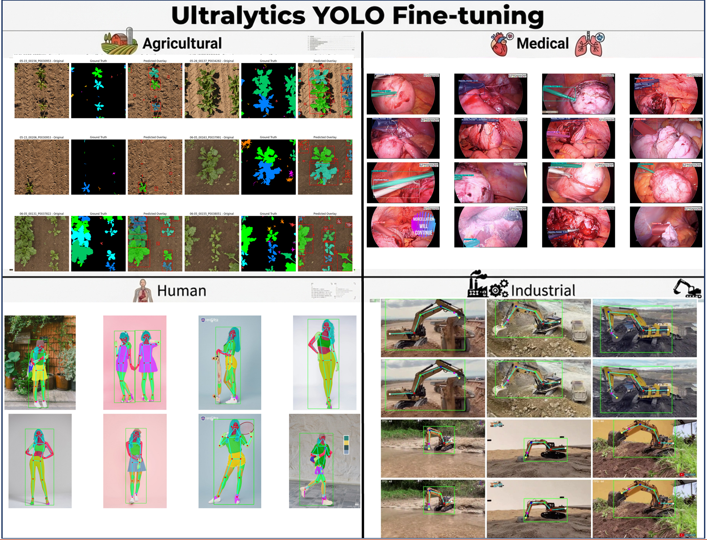

    <h1>YOLO Models Fine-tuning in Computer Vision </h1>

    <h3>Ultralytics Object Detection, Instance Segmentation, Keypoints Detection,   OBB Detection, Semantic Segmentation in PyTorch Fine-tuning </h3>

## Model Zoo

<b>Object Detection Models:</b>

- [x] [YOLOv9](https://github.com/NyiNyiMyo/YOLO-Models-Fine-tuning-in-Computer-Vision/blob/main/Object%20Detection/1-YOLOv9_det.ipynb)
- [ ] [YOLOv11]() (Coming Soon)
- [ ] [YOLOv26]() (Coming Soon)

<b>Instance Segmentation Models:</b>

- [x] [YOLOv8-Seg](https://github.com/NyiNyiMyo/YOLO-Models-Fine-tuning-in-Computer-Vision/blob/main/Instance%20Segmentation/1-YOLOv8_Seg.ipynb)
- [x] [YOLOv9-Seg](https://github.com/NyiNyiMyo/YOLO-Models-Fine-tuning-in-Computer-Vision/blob/main/Instance%20Segmentation/2-YOLOv9_Seg.ipynb)
- [x] [YOLOv9-Seg](https://github.com/NyiNyiMyo/YOLO-Models-Fine-tuning-in-Computer-Vision/blob/main/Instance%20Segmentation/3-YOLOv9_Seg.ipynb)
- [ ] [YOLOv11-Seg]() (Coming Soon)
- [x] [YOLOv26-Seg](https://github.com/NyiNyiMyo/YOLO-Models-Fine-tuning-in-Computer-Vision/blob/main/Instance%20Segmentation/5-YOLOv26_Seg.ipynb)

<b>Keypoints Detection Models:</b>

- [x] [YOLOv11-Pose](https://github.com/NyiNyiMyo/YOLO-Models-Fine-tuning-in-Computer-Vision/blob/main/Keypoints%20Detection/1-YOLOv11_keypoints.ipynb)
- [x] [YOLOv11-Pose](https://github.com/NyiNyiMyo/YOLO-Models-Fine-tuning-in-Computer-Vision/blob/main/Keypoints%20Detection/2-YOLOv11_keypoints.ipynb)
- [x] [YOLOv26-Pose](https://github.com/NyiNyiMyo/YOLO-Models-Fine-tuning-in-Computer-Vision/blob/main/Keypoints%20Detection/3-YOLOv26_keypoints.ipynb)

<b>OBB Detection Models:</b>

- [x] [YOLOv11-obb](https://github.com/NyiNyiMyo/YOLO-Models-Fine-tuning-in-Computer-Vision/blob/main/OBB%20Detection/1-YOLOv11_obb_det.ipynb)

<b>Semantic Segmentation Models:</b>

- [x] [YOLOv26-sem](https://github.com/NyiNyiMyo/YOLO-Models-Fine-tuning-in-Computer-Vision/blob/main/Semantic%20Segmentation/1-YOLOv26_sem_Seg.ipynb)

<b>Bonus:</b>

- **Object Tracking:**
  - [x] [YOLOv8_ByteTrack_Track](https://github.com/NyiNyiMyo/YOLO-Models-Fine-tuning-in-Computer-Vision/blob/main/Instance%20Segmentation/Bonus-1-YOLOv8_ByteTrack_Track.ipynb)

- **Part Segmentation:**
  - [x] [YOLOv26_Part_Seg](https://github.com/NyiNyiMyo/YOLO-Models-Fine-tuning-in-Computer-Vision/blob/main/Semantic%20Segmentation/Bonus-2-YOLOv26_Part_Seg.ipynb)

- **Panoptic Segmentation Fusion:**
  - [x] [YOLOv26_Pan_Seg](https://github.com/NyiNyiMyo/YOLO-Models-Fine-tuning-in-Computer-Vision/blob/main/Instance%20Segmentation/Bonus-3-YOLOv26_Pan_Seg.ipynb)

  
